<h1 align="center">⟲ loop</h1>
<p align="center"><b>Loop engineering for AI agents.</b><br>One file. Any agent. Until it's verified.</p>

<p align="center">
  <a href="https://github.com/raiyanyahya/loop/actions/workflows/ci.yml"></a>
  <a href="https://github.com/raiyanyahya/loop/actions/workflows/publish.yml"></a>
  <a href="https://github.com/raiyanyahya/loop/actions/workflows/pages.yml"></a>
  <a href="https://www.npmjs.com/package/@raiyanyahya/loop"></a>
  <a href="https://www.npmjs.com/package/@raiyanyahya/loop"></a>
  
  
  
  <a href="LICENSE"></a>
</p>

```
npx @raiyanyahya/loop demo        # watch a loop work, no API key needed
```

<p align="center"></p>
<p align="center"><sub>A real run: Claude Haiku 4.5 as worker and critic, <code>permissions: edits</code>, a three-item checklist, <code>node test.js</code> as the check, <code>test.js</code> protected. Three iterations, 2m13s, $0.23. Condensed for length only; every number, file, hash, and verdict is as printed.</sub></p>

---

The most powerful way to use a coding agent is not a longer conversation. It is a loop: run the agent, check its work, run it again, until the job is done. People run this with a `while true` in bash. It works, and it is blind: no memory between runs, it believes the agent when it says "done", it never stops on its own, and it leaves no record. Worse, the agent can quietly edit the tests that judge it.

**`loop` is that loop, engineered.** It runs Claude Code, Codex, Gemini CLI, Aider, or any agent CLI in a loop driven by one markdown file, and adds the parts the bash loop was missing. Every design decision follows what the research on long-running agents shows works; the evidence and the scorecard live in [docs/loop-engineering.md](docs/loop-engineering.md).

## Contents

- [Sixty seconds](#sixty-seconds)
- [The model: a loop has five parts](#the-model-a-loop-has-five-parts)
- [What is different about loop](#what-is-different-about-loop)
- [Kinds of loop](#kinds-of-loop)
- [Agents](#agents)
- [Loopfile reference](#loopfile-reference)
- [The loop protocol](#the-loop-protocol)
- [Commands](#commands)
- [Anatomy of an iteration](#anatomy-of-an-iteration)
- [What lands on disk](#what-lands-on-disk)
- [Recipes](#recipes)
- [Engineering notes](#engineering-notes)
- [Elsewhere: Action, plugin, website](#elsewhere-action-plugin-website)
- [Development](#development)
- [CI and releases](#ci-and-releases)
- [FAQ](#faq)

## Sixty seconds

```
npm i -g @raiyanyahya/loop     # installs the `loop` command
cd your-project
loop init             # asks what kind of loop, writes LOOP.md
loop run              # go
```

Or skip the file:

```
loop run -p "make the test-suite pass" --until "npm test" --protect "test/**"
```

Requirements: Node 18 or newer, one agent CLI on your PATH (`loop doctor` lists them), git for the features that revert or restore.

## The model: a loop has five parts

A loop is a **goal**, a **worker**, a **verifier**, **memory**, and **brakes**, run until the verifier is satisfied or the brakes engage. A Loopfile is those five parts in YAML frontmatter, followed by the goal in markdown. Humans read it, agents read it, and the loop re-reads it before every iteration.

```markdown
---
name: search-api
agent: [claude, codex]          # worker: two agents take turns
until: [checklist, "npm test"]  # verifier: every box ticked AND tests green
critic: codex                   # verifier: an independent review before "done" counts
protect: ["test/**", "SPEC.md"] # verifier: the agent may not edit these
memory: NOTES.md                # memory: durable notes, across loops
max: 30                         # brakes
max_cost: 20
git: true                       # every kept iteration is a commit
---

# Goal

Add full-text search to GET /posts. See SPEC.md.

# Checklist

- [ ] Migration: tsvector column and GIN index
- [ ] q= query param, ranked results
- [ ] Tests: ranking, empty query, injection
- [ ] README section with examples
```

What comes out of a loop is equally typed: the repository state (kept commits, reverted experiments discarded), a verdict with an exit code, the full trajectory in a journal, the metric curve, durable notes, and a notification.

## What is different about `loop`

**The letter.** Every iteration is a fresh session with no memory. Before it ends, the agent writes a short letter to its next self: what it did, what to do next, what to avoid. The loop puts that letter at the top of the next prompt, with a history table of every iteration so far (files changed, checks, metric, kept or reverted, critic verdict). It is the only memory that survives, and it turns a pile of amnesiac runs into one continuous worker. `memory: NOTES.md` adds a second, durable layer that outlives the loop: the agent keeps facts about the codebase there, and every future loop reads it.

**Verified done.** "Done" is a claim. `until:` lists what must actually hold: a test command exits 0, every checklist item is ticked, the agent says so, or all of them (conditions are AND-ed). A false claim is rejected, and the next iteration is told exactly why, with the failing output.

**A critic with a veto.** `critic: codex` runs an independent reviewer in its own session before "done" is accepted. It receives the goal, the diff (including new files), the automated check results, the metric, and the worker's letter, and replies `<loop:approve/>` or `<loop:reject>` with numbered reasons that feed the next iteration. `critic: same` uses the worker's agent in a fresh session; `when: 5` reviews every fifth iteration as well. The critic is told not to edit files; if it does anyway, its edits are restored when the loop is committing to git. The worker never grades its own work.

**Keep or revert.** `metric: "node bench.js"` turns the loop into an experiment loop, autoresearch style. The loop measures a baseline before iteration 1, then after each iteration: if the number did not improve on the best so far, the iteration is reverted with git and the history records what was tried. `direction: min` for latencies and losses. `target:` ends the loop as done when reached. `keep: no-regress` reverts any iteration where a check that used to pass now fails, whatever the goal. If the tree is dirty when a keep/revert loop starts, a baseline commit is made first so there is always a known-good state.

**Protected files.** `protect: ["test/**"]` restores any protected file the agent touched (tracked files from git, new files deleted) and rejects the iteration. Checklist items that get reworded, added, or deleted are restored too, keeping legitimate ticks. The verifier is not the agent's to edit.

**Relay and rituals.** `agent: [claude, codex]` alternates agents every iteration, and the prompt tells each who ran last. Rituals run a different instruction at fixed points: `at: 1` to plan before building, `every: 5` to review, `at: last` to wrap up. A ritual can run on a different agent.

**Brakes.** `max` iterations, `max_time`, `max_cost` (Claude reports spend), an iteration `timeout` that kills a runaway agent, stall detection for iterations that change nothing, and repeat detection for the same failure output over and over. Ctrl-C once finishes the current iteration cleanly so the letter gets written; twice kills the agent. `loop stop` from another terminal does the same.

**A journal.** Every prompt, output, changed file, check, metric, verdict, and critic review lands under `.loop/`. `loop log` is the timeline. `loop report` builds a single HTML page with the metric curve.

**Isolation and reach.** `git: { worktree: true }` runs the loop in its own worktree on its own branch while the journal stays in your main checkout. `sandbox:` wraps the agent command in a container or anything else. `notify:` posts to a webhook when the loop ends or needs you. A GitHub Action and a Claude Code skill ship in the repo.

## Kinds of loop

`loop init` asks which kind you want, or use `--kind`:

| kind | template | shape |
|---|---|---|
| finish | `default` | reach a goal, then stop: done when the agent says so and the checks pass |
| optimize | `optimize` | push a number: one experiment per iteration, kept only if the metric improves |
| maintain | `overnight` | keep improving for hours with no "done", commits and review rituals |
| research | `research` | not code: deepen a written report against a checklist, with a critic |
| full | `plan-build` | the whole harness: plan ritual, one item per iteration, protected tests, memory, critic |

More templates: `tdd`, `fix-ci`, `checklist`, `relay`, `ralph`. `loop init --list` shows them all with a one-line description. Non-interactive: `loop init tdd --yes --agent claude --goal "..." --test "npm test" --protect "test/**"`. Optimize loops also take `--metric` and `--direction`.

## Agents

| `agent:` | CLI | how it runs |
|---|---|---|
| `claude` | Claude Code | `claude -p --output-format stream-json --verbose --dangerously-skip-permissions` (live tool calls and cost) |
| `codex` | Codex CLI | `codex exec --dangerously-bypass-approvals-and-sandbox --skip-git-repo-check -` (prompt on stdin) |
| `gemini` | Gemini CLI | `gemini --yolo -p <prompt>` |
| `aider` | Aider | `aider --message-file <prompt> --yes-always` |
| `opencode` | OpenCode | `opencode run <prompt>` |
| `copilot` | GitHub Copilot CLI | `copilot -p <prompt> --allow-all-tools` |
| `amp` | Amp | `amp -x --dangerously-allow-all` (prompt on stdin) |
| `goose` | Goose | `goose run -i <prompt>` |
| `cursor` | Cursor Agent | `cursor-agent -p <prompt> --force` |
| custom | anything | `command: "my-agent --auto {promptfile}"` |

`model:` is passed to each CLI's model flag; `args:` appends anything else. For a custom `command:`, `{promptfile}` is replaced by the prompt's path, `{prompt}` by the shell-quoted prompt, and with neither the prompt is piped to stdin. `sandbox:` wraps whatever the adapter builds: `{cmd}` is the quoted agent command, `{cwd}` the working directory.

The `claude` adapter is exercised in this repo. The others follow the vendors' documented non-interactive flags; run `loop doctor` to see what is installed and `loop run --dry` to see the exact command before spending anything. By default every adapter runs the agent with permissions bypassed, because that is what a loop is for. `permissions: edits` is the narrower option: file edits are auto-approved and everything else, including shell commands, is denied, so the loop's own `until` checks do the running. It maps to `--permission-mode acceptEdits` for Claude, `--sandbox workspace-write` for Codex, and `--approval-mode auto_edit` for Gemini. Either way, run loops in a worktree, a container, or a repository you can afford to reset.

When started from inside a Claude Code session, the loop strips the nested-session environment so a child `claude` starts cleanly. If Claude fails to authenticate twice in a row, the iteration is aborted instead of sitting through ten retries.

## Loopfile reference

```yaml
# goal
name: my-loop             # shown in output and commits (default: directory name)
context: [SPEC.md]        # files inlined into every prompt

# worker
agent: claude             # or a list for relay: [claude, codex]
model: opus               # passed to the agent's --model flag
args: ["--max-turns", "50"]   # extra CLI args for the agent
command: "..."            # custom agent; {prompt} or {promptfile} are substituted, else stdin
sandbox: "docker run --rm -i -v {cwd}:/work -w /work img sh -c {cmd}"
permissions: bypass       # bypass (no prompts) | edits (file edits only, no shell) | default (the agent's own)
cwd: packages/api         # work in a subdirectory
env: { MY_VAR: value }    # extra environment for the agent and hooks

# verifier
until: done               # done | checklist | never | "<shell command>" | a list (all must hold)
metric: "node bench.js"   # a command that prints a number (the last number in its output)
direction: max            # or min
keep: improve             # improve | no-regress | always   (default: improve when metric is set)
target: 1.80              # reaching it ends the loop as done
protect: ["test/**"]      # globs the agent may not modify; restored if it does
critic: codex             # or "same", or { agent, model, when: done | N, prompt }

# memory
letter: true              # the letter to the next iteration (.loop/letter.md); a path to move it
memory: NOTES.md          # durable notes the agent maintains across loops

# brakes
max: 25                   # iterations
max_time: 8h              # wall clock
max_cost: 20              # USD, agents that report cost
timeout: 1h               # per iteration, for the agent process
check_timeout: 10m        # for each check, feedback, metric, and hook command
stall: 3                  # stop after N iterations that changed nothing (0 disables)
repeat: 3                 # stop after the same failure N times in a row (0 disables)

# rhythm and hooks
sleep: 0                  # pause between iterations (30s, 5m)
rituals:
  - at: 1                 # or every: 5, or at: last   (at wins over every)
    name: plan
    agent: codex          # optional
    prompt: |
      ...
feedback: ["npm run lint 2>&1 | tail -40"]   # run before each iteration, output goes in the prompt
before: ["..."]           # hooks: shell commands before each iteration
after: ["..."]            # after the agent, before the checks (LOOP_CHANGED lists the files)
on_done: ["..."]          # when the loop ends as done
on_stop: ["..."]          # when it ends any other way
notify: https://hooks.slack.com/...   # POSTed when the loop ends or needs you

# git
git: true                 # commit after every kept iteration
git:
  commit: true
  branch: loop/my-loop    # create or switch to this branch first
  worktree: true          # run in .loop/worktrees/<name> on that branch
```

Durations accept `30`, `30s`, `5m`, `8h`, `1h30m`. Every key can be overridden from the command line: `--agent`, `--model`, `--permissions`, `--until` (repeatable), `--metric`, `--direction`, `--target`, `--keep`, `--critic`, `--protect` (repeatable), `--memory`, `--notify`, `--max`, `--max-time`, `--max-cost`, `--sleep`, `--stall`, `--name`.

Commands run by the loop (hooks, checks, feedback, metric, the agent itself) see these environment variables: `LOOP=1`, `LOOP_NAME`, `LOOP_ITERATION`, `LOOP_AGENT`, `LOOP_ROLE` (`worker` or `critic`), `LOOP_PROMPT_FILE`, `LOOP_WORKDIR`, `LOOP_CHANGED` (after hooks), and at the end `LOOP_STATUS`, `LOOP_REASON`, `LOOP_ITERATIONS`, `LOOP_COST`.

## The loop protocol

The agent talks back in plain text, on its own line. A tag only counts at the start of a line, so the agent can talk about the protocol without triggering it.

| signal | effect |
|---|---|
| `<loop:done/>` | everything is complete; the loop verifies and asks the critic |
| `<loop:stuck>why</loop:stuck>` | stop; a human is needed. `loop run` continues later with the letter intact |
| `<loop:ask>question</loop:ask>` | in a terminal, you are asked right there; unattended, the loop parks itself (exit 3) until `loop answer "..."` and `loop run` |
| `<loop:handoff>codex</loop:handoff>` | run the next iteration on a different installed agent |
| `<loop:sleep>10m</loop:sleep>` | wait before the next iteration |
| `<loop:note>text</loop:note>` | leave a note in the journal |
| `<loop:approve/>` | the critic accepts the work |
| `<loop:reject>reasons</loop:reject>` | the critic blocks "done"; the reasons go into the next prompt |

## Commands

```
loop init [template]      write a LOOP.md   (--kind finish|optimize|maintain|research, --list, --force, --yes)
loop run [file | name]    run the loop      (name resolves name.md, loops/name.md, LOOP-name.md)
loop run -p "goal"        ad-hoc loop, no file
loop run --dry            print the assembled prompt and the exact command; run nothing
loop run --once           a single iteration, to test a Loopfile
loop run --fresh          forget the letter first
loop run --quiet          headers and verdicts only, no agent output (for logs and CI)
loop status [--json]      what the loop is doing (works from another terminal)
loop log [--runs] [--run id]   iteration timeline: result, metric, critic, verdict, letter
loop report [--open] [--out file]   shareable HTML report with the metric curve
loop stop [--now]         stop after this iteration, or kill the agent now
loop answer "text"        reply to a <loop:ask>, then loop run continues
loop letter [--clear]     the letter between iterations
loop doctor               installed agents, environment, Loopfile sanity
loop demo [--dir path] [--quick]   a scripted agent runs a real loop in a temp git repo; nothing to install or pay for
```

Exit codes: `0` done, `1` stopped or failed, `2` stuck, `3` waiting for an answer. Only one loop runs per directory at a time; a second `loop run` is refused while the first is alive.

## Anatomy of an iteration

1. **Guards.** Iterations, wall clock, cost, a `STOP` file from `loop stop`, Ctrl-C.
2. **Re-read the Loopfile.** You can edit the goal or the limits while it runs. Ticks are honoured; rewordings are not.
3. **Pick the agent and the instruction.** Relay rotation or a handoff; a ritual replaces the goal if one is due (`at` wins over `every`).
4. **Hooks and feedback.** `before` hooks, then `feedback` commands, whose output goes into the prompt along with anything carried over from the last verdict.
5. **Assemble the prompt.** The Loopfile body, a status block, the history table, the notes file, context files, the letter, any human answer, feedback, any rejection or revert or restore from last time, and the rules of the loop. The prompt is written to the journal before the agent runs.
6. **Run the worker.** In its own process group, with a timeout. Output streams to the terminal and to the journal.
7. **Integrity.** Snapshot the tree, list what changed, restore protected files, restore the checklist text, read the letter, parse signals, add up cost. `after` hooks run.
8. **Verify.** Every `until` command runs and its result is recorded. The metric is measured. The iteration is kept (and committed) or reverted, and the best-so-far and per-check pass/fail state are updated only for kept iterations.
9. **Critic.** If the loop would finish, or a periodic review is due, the critic reads the goal, diff, checks, and letter in a fresh session and approves or rejects.
10. **Verdict.** Done, continue, stuck, waiting, stalled, or stopped. The journal and state file are written. Notify, hooks, sleep, repeat.

## What lands on disk

```
.loop/
  state.json                  what `loop status` reads: status, iteration, cost, metric, pid, question
  letter.md                   the letter to the next iteration (in the worktree when one is used)
  answer.md                   your reply to a <loop:ask>, consumed by the next iteration
  STOP                        written by `loop stop`, consumed between iterations
  report.html                 `loop report` output
  worktrees/<name>/           when git.worktree is on
  runs/<timestamp>/
    journal.jsonl             one event per line: start, baseline, spawn, iteration, critic, note, answer, end
    iter-001/
      prompt.md               exactly what the worker saw
      output.txt              everything it printed
      letter.md               the letter it left
      critic-prompt.md        what the critic saw, when it ran
      critic-output.txt       what the critic said
```

Add `.loop/` to `.gitignore`; `loop init` does it for you. Commits made by the loop exclude it.

## Recipes

```bash
# Fix a red build; green is done, and the tests are off limits
loop run -p "Make CI pass. Fix root causes." --until "npm test" --protect "test/**"

# Make it faster without breaking it: measure, keep wins, revert the rest
loop init --kind optimize && loop run

# Plan first, build one item per iteration, critic before done
loop init plan-build && loop run

# Overnight in a worktree: 8 hours, commits, review every 5th iteration, ping me when it stops
loop init --kind maintain && nohup loop run > loop.out &

# Claude builds, Codex reviews and judges
loop init relay && loop run

# Several loops in one repo
loop run search-api        # loops/search-api.md
loop run perf              # loops/perf.md

# Look before you spend
loop run --dry
```

## Engineering notes

**Why a file.** The Loopfile is the unit of loop engineering. Frontmatter for the loop, markdown for the agent, in one file that lives in the repo, gets reviewed in pull requests, and is read by both humans and agents. Everything the loop does is a key in that file, and every key can be deleted. Anthropic removed sprints and context resets from their own harness within one model generation; a loop tool has to make its features that cheap to drop.

**Why the letter instead of a long session.** Context rot is measured, not folklore: quality drops as context fills, and long sessions end in premature completion or a bad handoff. So each iteration is a fresh process, and the only state that crosses the boundary is written down: the letter, the notes file, the checklist ticks, the git history, and a history table the loop builds from its own journal. That is also why the loop never tries to resume an agent session. Files are the memory.

**Why the verifier is defended.** The research on reward hacking is unambiguous: given a visible grader, agents will satisfy the grader rather than the goal, from weakened tests to lookup tables. So `until` runs commands the agent cannot argue with; `protect` restores the files that hold the tests and the spec; the checklist cannot be reworded; a metric loop reverts anything that does not measurably win; and the critic reads the actual diff in a session that has no stake in the outcome. None of this is a guarantee. It raises the cost of cheating above the cost of doing the work, which is the most a harness can do.

**Why revert rather than warn.** A warning in the next prompt is advice. A revert is a fact: the repository is back at the last kept commit, and the history table says what was tried and why it was rolled back. Autoresearch and AlphaEvolve both work this way, and it is the only policy that lets a loop run unattended for hours without accumulating damage.

**Why the critic is a separate session, not a second pass.** Self-grading is lenient; the same model rates its own work roughly twice as favourably as an independent judge does. The critic gets a different prompt, its own context, optionally a different agent or model, and a veto. It runs at the point of maximum leverage, when the loop would otherwise stop, and it costs one extra session per claimed completion rather than per iteration.

**Why the brakes are several.** Each catches a different failure. `max` and `max_time` bound the bill. `max_cost` bounds it in dollars where the agent reports them. `timeout` kills a hung process. `stall` catches an agent that has run out of ideas. `repeat` catches an agent that has one idea and keeps trying it. Ctrl-C is two-stage because the letter is written at the end of an iteration, and a loop killed mid-iteration loses its memory of what it was doing.

**Why the protocol is plain text.** Tags on their own line work with any agent that can print, need no tool integration, survive stream parsing, and are easy to grep in a journal. The start-of-line rule means an agent can discuss the protocol without triggering it.

**Why zero dependencies.** The whole tool is about 3,000 lines of Node with no packages, including a YAML subset parser. It installs in a second, has no supply chain to audit, and runs anywhere Node 18 runs. The stream-json parsing for Claude, the process-group signalling, the git snapshots, and the webhook client are all small enough to own.

**What was deliberately left out.** No daemon, no database, no server: the journal is files and the state is a JSON document, so `loop status` works from any terminal and the whole run can be zipped and shared. No LLM-as-judge without an executable check underneath it. No parallel branches yet; worktrees make that possible without changing the core. No sandbox on by default, because the right sandbox depends on the project; the switch is one key.

**How it is tested.** A scripted fake agent plays every role, including the critic, so the whole engine runs end to end under `node --test` without an API key: rejected done claims, reverts on regression and on a flat metric, target reached, protected files restored, checklist rewordings restored, critic reject then approve, periodic reviews, repeat detection, rituals at fixed points, memory inlining, a live webhook, a real git worktree, the sandbox wrapper, and every CLI command. Ctrl-C once and twice, and `loop stop --now`, were verified by hand. `loop demo` runs the same fake agent through a real loop in a temporary git repo.

## Elsewhere: Action, plugin, website

**GitHub Action.** The repo root has an `action.yml`, so any repository can run a Loopfile from a workflow. Inputs: `loopfile` (default `LOOP.md`), `agent`, `max`, `extra` (more `loop run` flags), `version`. Output: `status`. The job must provide the agent CLI and its credentials; the step's exit code follows the loop's.

```yaml
- uses: raiyanyahya/loop@main
  with:
    loopfile: loops/fix-ci.md
    extra: --until "npm test" --protect "test/**"
  env:
    ANTHROPIC_API_KEY: ${{ secrets.ANTHROPIC_API_KEY }}
```

**Claude Code plugin.** `.claude-plugin/plugin.json` plus `skills/loop/SKILL.md`: a skill that teaches Claude how to write a Loopfile, pick a kind, and behave when it is the agent inside a loop. Install the repo as a plugin, or copy `skills/loop` into your project's `.claude/skills/`.

**Website.** `docs/index.html` is a single self-contained page with a replay of a loop run. Serve `docs/` with GitHub Pages.

## Development

```
git clone https://github.com/raiyanyahya/loop
cd loop
npm test                 # 68 tests, no API key needed
npm run test:torture     # edge cases against the real CLI: unicode paths, huge output, timeouts, concurrency
node bin/loop.js demo    # a real loop in a temporary git repo
npm link                 # puts `loop` on your PATH from this checkout
npm run demo:svg         # regenerate the animated demo above
```

Layout: `bin/loop.js` is the entry point, `src/runner.js` the engine, `src/loopfile.js` the config schema, `src/prompt.js` the worker and critic prompts, `src/agents.js` the adapters, `src/protocol.js` the tags, `src/git.js` snapshots and reverts, `src/journal.js` the on-disk record, `src/report.js` the HTML report, `src/fake-agent.js` the scripted agent the tests and the demo use. Templates live in `templates/`, the website in `docs/`. See [CONTRIBUTING.md](CONTRIBUTING.md) for the ground rules and [CHANGELOG.md](CHANGELOG.md) for what changed.

## CI and releases

Three workflows in `.github/workflows/`:

| workflow | runs | does |
|---|---|---|
| CI | every push and pull request | `npm test` on Node 18, 20, and 22 on Ubuntu and macOS, the demo end to end, a tarball check, and a check that `docs/demo.svg` is reproducible |
| Publish | on a `v*` tag | tests, verifies the tag matches `package.json`, publishes `@raiyanyahya/loop` to npm through [trusted publishing](https://docs.npmjs.com/trusted-publishers): no token, provenance automatic |
| Website | pushes to `main` that touch `docs/` | deploys `docs/` to GitHub Pages |

Release: bump the version, add a changelog entry, `git tag vX.Y.Z`, push the tag. The trusted publisher on npmjs.com (package settings) is GitHub Actions, user `raiyanyahya`, repository `loop`, workflow `publish.yml`.

## FAQ

**Is this just the Ralph loop?** The Ralph loop (`while :; do cat PROMPT.md | claude; done`) is the ancestor and `loop init ralph` gives you that shape. `loop` adds memory, verification, a critic, keep-or-revert, protected files, brakes, and a record.

**Can the agent game the checks?** Less than usual. Tests can be protected, the checklist cannot be edited, a metric loop reverts anything that does not measurably win, and a critic reads the diff. None of that is a guarantee: hold out checks the agent cannot see, and review anything with a suspicious jump.

**What about cost?** Claude Code reports cost per session; the loop sums it, shows it in every header, and stops at `max_cost`. Other agents do not report cost, so use `max` and `max_time`. The critic's sessions count toward the same total.

**Does it need git?** No, but keep/revert, protected-file restore, worktrees, and the critic's diff do. Without git, `loop` still tracks changes by walking the tree and reports what it would have reverted.

**Why is the package scoped?** The npm name `loop` belongs to an unrelated package, `loop-cli` is a name npm has permanently retired, and `theloop` is blocked as too similar to `the-loop`. `@raiyanyahya/loop` matches the GitHub repository exactly, and `npm i -g @raiyanyahya/loop` installs the `loop` command.

**Windows?** It should work (no shell tricks, no native deps), but it is not tested there yet. Process-group signalling is Unix-only, so Ctrl-C handling is simpler on Windows.

## Loop engineering

A prompt is a request. A loop is a process. Writing a good Loopfile is a different skill from writing a good prompt: you design the stopping condition before the work, you decide what the loop checks and what it trusts, you give the agent a way to hand off to itself, and you set a budget. The research behind these choices, a scorecard, and what not to build: [docs/loop-engineering.md](docs/loop-engineering.md).

Zero dependencies. Node 18+. MIT.
